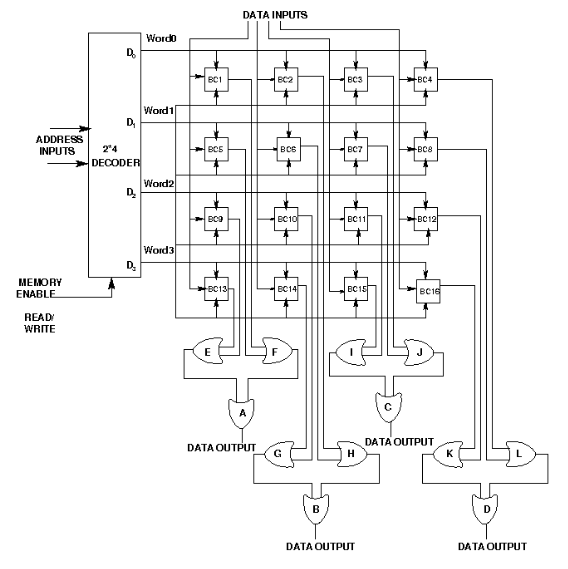

# Circuit Diagram of 4 x 3 RAM Memory:

# Components Required:

For Designing a RAM Cell

<strong>To build a RAM Cell, we need :</strong>

1. AND Gate(2 input)-6
2. NOT Gate-2
3. RS Flip Flop-1

For Designing a 4X3 RAM

<strong>To build a 4X3 RAM, we need :</strong>

1. OR Gate(2 input)-11
2. RAM Cell-12
3. 2X4 Decoder with Enable-1

# Circuit of a RAM Cell on simulator:

# Circuit of SR Flipflop:

# Circuit for 3 Input AND Gate:

- Follow the below manual and perform the experiment
    - Manual --> [Click Here](./simulation/coavlNew.pdf)

<embed src="./simulation/coavlNew.pdf" type="application/pdf">

