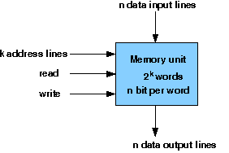
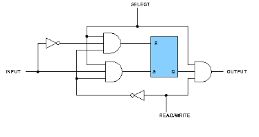
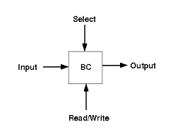
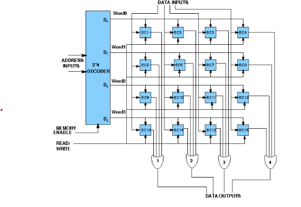

### Design of Memory :

A memory unit is a collection of storage cells together with associated circuits needed to transform insformation in and out of the device. Memory cells which can be accessed for information transfer to or from any desired random location is called random access memory(RAM). The block diagram of a memory unit-

**Internal Construction:** The internal construction of a random-access memory of m words with n bits per word consists of m*n binary storage cells and associated decoding circuits for selecting individual words. The binary cell is the basic building block of a memory unit.

### RAM Design:

## Design of a RAM cell :

The binary cell has three inputs and one output. The select input enables the cell for reading or writing and the reda/write input determines the cell operation when it is selected. A 1 in the read/write input provides the read operation by forming a path from the flip-flop to the output terminal. A 0 in the read/write input provides the write operation by forming a path from the input terminal to the flip-flop. the logic diagram is-

## Design of a 4X4 RAM :

The logical construction of a small RAM 4X3 is shown below. It consists of 4 words of 3 bits each and has a total of 12 binary cells. Each block labeled BC represents the binary cell with its 3 inputs and 1 output. The block diagram of a binary cell-

A memory with 4 words needs two address lines. The two address inputs go through a 2*4 decoder to select one of the four words. The decoder is enabled with the memory enable input. When the memory enable is 0, all outputs of the decoder are 0 and none of the memory words are selected. With the memory enable at 1, one of the four words is selected, dictated by the value in the two address lines. Once a word has been selected, the read/write input determines the operation. the logic diagram is-

**Design Issues :**

A basic RAM cell has been provided here as a component which can be used to design larger memory units. An IC memory consisting of 4 words each having 3 bits has been aslo provided.

